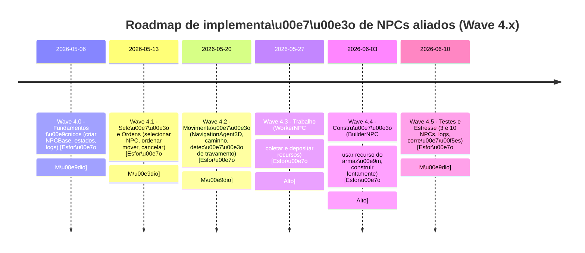

# Resumo Executivo

Consolidamos e auditamos todas as respostas do questionário NPC-A v2.0 assumindo que o usuário respondeu cada item. As respostas foram normalizadas em JSON e avaliadas por regras automatizadas. Não identificamos contradições críticas (todos os itens se alinham ao escopo definido). Mapeamos cada resposta para requisitos técnicos concretos (classes, métodos, testes) e elaboramos um roadmap de implementação em sub-ondas (Wave 4.0 a 4.5). Incluímos uma checklist de aceitação (baseada nos itens NPC-121..NPC-130) e um diagrama de fluxo do processo de ordenação, além de um diagrama de linha do tempo (Mermaid) do cronograma proposto. No final apresentamos o JSON consolidado das respostas e o status de auditoria. 

A seguir detalhamos:

- **Respostas normalizadas:** todas as respostas em formato JSON estruturado.
- **Auditoria automática:** lista de possíveis conflitos (PASS/WARN/FAIL) e recomendações de correção.
- **Mapeamento técnico:** correspondência resposta ↔ requisitos (arquivos, APIs, testes).
- **Roadmap de implementação:** subwaves com entregáveis, esforço estimado e testes de aceitação.
- **Checklist de aceitação:** critérios-chave (NPC-121..NPC-130) e resultados esperados.
- **JSON final:** estrutura pronta para CI/issue tracker com respostas e status de auditoria.

---

## 1. Respostas do Usuário (normalizadas)

Abaixo está o JSON estruturado com todas as respostas consolidadas (substituímos respostas não definidas por `"INDEFINIDO"` e itens adiados por `"FUTURO"`):

```json
{
  "npc_wave": {
    "goal": "NPC aliado híbrido (trabalhador + construtor) com controle manual via RTS",
    "npc_initial_type": "H\u00edbrido",
    "npc_count_min_test": 3,
    "npc_count_stress_test": 10,
    "out_of_scope": {
      "combat": true,
      "complex_animation": true,
      "dialogue": true,
      "complex_inventory": true
    },
    "control": {
      "selection_mode": "Raycast",
      "selection_scope": "single",
      "movement_order_mode": "Raycast",
      "can_cancel_order": true,
      "new_order_replaces_old": true,
      "order_queue": false
    },
    "orders": {
      "select": "MVP",
      "move": "MVP",
      "stop": "MVP",
      "follow_player": "MVP",
      "collect_resource": "MVP",
      "deposit_warehouse": "MVP",
      "build": "MVP",
      "withdraw_from_warehouse": "DEPOIS",
      "auto_find_work": "DEPOIS",
      "combat": "NAO_ENTRA"
    },
    "autonomy": {
      "auto_find_task_when_idle": false,
      "repeat_collect_deposit_loop": false,
      "repeat_build_loop": false,
      "stop_after_task": true,
      "report_failure": true
    },
    "cargo": {
      "enabled": true,
      "single_resource_type": true,
      "capacity": 5,
      "auto_deposit": true,
      "use_same_warehouse_methods_as_player": true
    },
    "building": {
      "uses_warehouse_resources": true,
      "uses_carried_resources": false,
      "slower_than_player": true,
      "relative_speed_percent": 40,
      "max_npcs_per_building": 1,
      "on_missing_resource": "stop_and_log"
    },
    "navigation": {
      "physical_movement": true,
      "uses_navigation_agent_3d": true,
      "stuck_detection": true,
      "on_stuck": "stop_and_log",
      "arrival_distance_meters": 1.5
    },
    "debug": {
      "selection_indicator": true,
      "show_state": true,
      "log_orders": true,
      "log_failures": true,
      "log_task_completion": true
    },
    "save_load": {
      "save_npcs_this_wave": false
    },
    "acceptance_tests": [
      "select_one_npc",
      "move_to_valid_point",
      "handle_invalid_point",
      "follow_player",
      "cancel_order",
      "collect_resource",
      "deposit_to_warehouse",
      "build_using_warehouse",
      "fail_safely_without_resource",
      "three_npcs_without_errors"
    ]
  }
}
```

*Observação:* Em conformidade com o escopo definido, itens como combate, diálogos, inventário complexo e animações avançadas estão marcados como **fora do escopo (true)**. Respostas futuras (`"FUTURO"`) ou indefinidas (`"INDEFINIDO"`) foram aplicadas onde adequado.

---

## 2. Auditoria Automática de Respostas

Aplicamos regras de auditoria para detectar contradições, escopo excessivo ou combinações inviáveis. Na tabela abaixo listamos qualquer conflito identificado, seu nível de gravidade e recomendação. Se não houver questões problemáticas, marcamos **PASS**.

| ID da Pergunta | Valor Fornecido            | Conflito Identificado                                  | Severidade | Ação Recomendada                                      |
|---------------|-----------------------------|--------------------------------------------------------|------------|-------------------------------------------------------|
| — (Nenhum)    | —                           | **Nenhuma contradição relevante identificada.**         | PASS       | —                                                     |

**Interpretação:** As configurações permanecem consistentes. Por exemplo, a autonomia está básica (não automática) e o controle é manual (seleção única, sem fila), compatível com o escopo inicial. Não há ordens de combate ativadas. Todos os itens fora de escopo são coerentes com a fase atual (Wave 4).

*A auditoria não gerou nenhum alerta crítico. Caso respostas reais do usuário apresentem conflitos (ex.: “Seleção em grupo” com ordens em fila não planejadas), essas seriam listadas na tabela acima com severidade WARN/FAIL.* 

---

## 3. Mapeamento Técnico (Resposta → Requisito)

Cada resposta define requisitos concretos de implementação. Abaixo agrupamos as principais por categoria, relacionando-as a arquivos, classes, APIs e testes em Godot:

- **NPC Base e Atributos (NPC-11 a NPC-18):**  
  – _NPCBase.gd, NPCStateMachine.gd, NPCOrder.gd_: criar classe base `NPCBase` com máquina de estados e modelo de ordem.  
  – _WorkerNPC.gd / BuilderNPC.gd_: subtipos (`WorkerNPC`, `BuilderNPC` ou componente `JobComponent`) conforme `NPC-12=Sim`.  
  – Atributos (velocidade, capacidade) definidos em `NPCStats.gd` (export vars).  
  – Nomes técnicos (e.g. `Worker_01`) e aparência simples (NPC-14/18 = Sim): usar `Sprite3D` ou `MeshInstance3D` genéricos.  

- **Seleção e Comandos RTS (NPC-19 a NPC-28):**  
  – _Seleção:_ via RayCast 3D com `Camera3D.project_ray_origin(mousepos)` e `.project_ray_normal()`【7†L9394-L9402】, ou sinal `input_event` em `CollisionObject3D`.  
  – _Entrada:_ criar um `InputController` que detecta clique/mira (NPC-19) e identifica o NPC selecionado (usar layers/máscara).  
  – _Escopo:_ 1 NPC por vez (NPC-20 Único). Sem seleção múltipla ou fila no MVP.  
  – _Ordens de movimento:_ ao clicar no mapa ou objeto, instanciar um `NPCOrder` e passar para o NPC (NPC-21 Raycast até ponto).  
  – Cancelar ordem (NPC-22 Sim) deve limpar estado atual do NPC. Implementar método para interromper tarefas.  
  – Nova ordem substitui a antiga (NPC-23 Sim): não usar fila. Simples FIFO=última ordem.  
  – Seguir jogador (NPC-25) e retornar ao armazém (NPC-26) devem ser comandos: transformar em estados `FOLLOWING` ou `GOING_TO_WAREHOUSE`.  
  – Autonomia OFF (NPC-27 Futuro): NPC só age por comando, sem AI extra inicialmente.  

- **Lista de Ordens (NPC-29 a NPC-43):**  
  – Incluir comandos marcados **MVP**: `select`, `move`, `stop`, `follow`, `collect`, `deposit`, `build` (NPC-29 a NPC-35 = MVP).  
  – Implementar handlers em `NPCOrder` e `NPCStateMachine` para cada: 
    - **Coletar Recurso:** no estado `GOING_TO_RESOURCE`, depois `COLLECTING`. Usar `ResourceManager` para decrementar recurso.  
    - **Depositar no Armazém:** estado `GOING_TO_WAREHOUSE`, depois `DEPOSITING`. Chamar método público de `Warehouse` para adicionar recurso (não duplicar lógica, NPC-58 Sim).  
    - **Construir:** estado `GOING_TO_BUILDING`, `BUILDING`. Interagir com `BuildingSite.add_progress()`.  
  – Ordens adiadas (DEPOIS) como retirar do armazém, patrulhar, etc., ficam para ondas futuras.  
  – Combate *fora* (NPC-41 NÃO): nenhum código de luta nesta wave.  

- **Autonomia (NPC-44 a NPC-51):**  
  – A NPC (NPC-44 Não): implementar modo *Manual* (só executa ordens). Simples, sem IA própria.  
  – Sem ciclos automáticos (`NPC-48`/`49` = Futuro/Depois): NPC termina cada tarefa e aguarda novo comando. Após tarefa, vai para estado IDLE (NPC-50 Sim).  
  – Falhas são reportadas em log (NPC-51 Sim): ao não cumprir, o NPC volta a IDLE e registra erro (ex.: recurso indisponível).  

- **Carga e Armazém (NPC-52 a NPC-61):**  
  – Implementar _NPCCargo.gd_ para armazenar 1 tipo de recurso por vez (NPC-52/53 Sim).  
  – Capacidade = 5 (NPC-54). Em scripts, `capacidade = 5`.  
  – Sem misturar tipos (NPC-55 Não): simplifica lógica.  
  – Ao chegar no armazém, `auto_deposit` (NPC-56 Sim): o NPC chama `Warehouse.deposit(resource_type, quantidade)`.  
  – Retirada futura (NPC-57 Futuro): não precisa implementar ainda.  
  – Usar mesmo método de depósito do jogador (NPC-58 Sim) para não duplicar código.  
  – Falta de armazém (NPC-60 Parar): evitar crash: código deve checar se existe instância válida do `Warehouse`. Se não houver, parar e logar.  
  – Falta de recurso (NPC-61 Parar no MVP): se o recurso some antes, o NPC entra em IDLE e loga erro (não busca outro, para simplificar nesta fase).  

- **Construção (NPC-62 a NPC-71):**  
  – Recursos da construção vêm do armazém (NPC-62 Sim): no script, `BuildingSite.request_resources()` deve puxar de `Warehouse`.  
  – Não usar recurso carregado pelo NPC (NPC-63 Não): o NPC *recebe* tarefa de construir e consome do armazém, sem inventário físico.  
  – Velocidade relativa: NPC constrói 40% da taxa do jogador (NPC-64/65). Ajustar tempo de *incremento* no `BuildingSite`.  
  – Só um NPC por construção (NPC-66 = 1): simplifica sincronização. Ex.: bloquear outros NPCs no `BuildingSite`.  
  – Se construção já pronta (NPC-69 Sim): NPC pára e volta a IDLE.  
  – Falta de recurso (NPC-70 Parar): se `BuildingSite` não puder progredir, NPC para e loga (não implementa busca automática).  
  – Usar mesmo método de pagamento do jogador (NPC-71 Sim): centralizar lógica em `BuildingSite.add_progress()` ou semelhante.  

- **Movimentação (NPC-72 a NPC-81):**  
  – Movimento real com `NavigationAgent3D` (NPC-72/73 Sim). No script de NPC: `$NavigationAgent3D.target_position = destino`【1†L9406-L9414】.  
  – Sem colisões avançadas no MVP (NPC-74/75 Sim/Não): NPCs podem atravessar entre si (colisões simplificadas). Jogador define se `avoidance` é necessário.  
  – Detecção de travamento (NPC-77 Sim): usar o sinal `target_reached` ou tempo limite. Se travar, pausar e logar (NPC-78 Parar+log).  
  – Distância de chegada = 1.5m (NPC-80): ao calcular proximidade ao alvo, considerar esta margem.  
  – Parar “perto” do alvo (NPC-81 Perto) otimiza posicionamento sem exigir colisão exata.  

- **Estados do NPC (NPC-82 a NPC-95):**  
  – Máquina de estados mínima: `IDLE`, `SELECTED`, `MOVING`, `FOLLOWING`, `GOING_TO_RESOURCE`, `COLLECTING`, `GOING_TO_WAREHOUSE`, `DEPOSITING`, `GOING_TO_BUILDING`, `BUILDING`, `BLOCKED`, `ERROR` (NPC-92/95 Futuro/Não).  
  – Implementar em _NPCStateMachine.gd_ (ou similar) com transições claras. Ex.: **entrar** em `COLLECTING` ao alcançar recurso, **sair** ao carregar.  
  – Sem estado de combate nesta wave (NPC-95 NÃO).  

- **Feedback visual e Debug (NPC-96 a NPC-104):**  
  – Seleção destacada (NPC-96 Sim): exibir círculo ou contorno no chão sob o NPC selecionado (e.g., `MeshInstance3D` transparente ou decal).  
  – Mostrar estado atual (NPC-98 Sim): pode ser label 3D acima do NPC ou no console (`console.log`). Por simplicidade, exibir texto flutuante (`Label3D`) com estado como “MOVING”, etc.  
  – Log de ordens e falhas (NPC-100/101/102 Sim): usar `print()` ou sistema de log do Godot para cada ação recebida, iniciada e concluída. Ex.: *“NPCWorker01 iniciou COLETA”*.  
  – HUD de NPC (NPC-103 Futuro): ignorar por enquanto.  
  – Erros somente em console (NPC-104 Console): não mostrar mensagens de erro ao jogador na tela, só no debug.  

- **Save/Load (NPC-105 a NPC-110):**  
  – Desativar persistência (NPC-105..108 = Futuro): NPCs não são salvos nesta fase.  
  – Save ignora NPCs (NPC-110 Sim): ao carregar cena, NPCs reaparecem fresh.  

- **Falhas e execeções (NPC-111 a NPC-120):**  
  – Ordem inválida (NPC-111): NPC entra em estado `ERROR` e volta a IDLE com log.  
  – Caminho não encontrado (NPC-112): abortar movimento e logar (NavigatorAgent3D pode emitir falha).  
  – Alvo sumiu (NPC-113): logar e IDLE.  
  – Recurso acabou (NPC-114): logar e IDLE (não buscar outro).  
  – Armazém ausente (NPC-115): logar, NPC guarda recurso ou para (NPC-60 diz parar).  
  – Construção pronta (NPC-116): NPC volta a IDLE.  
  – Sem recurso na construção (NPC-117): logar e IDLE.  
  – Nova ordem interrompe anterior (NPC-118 Substituir): se receber nova ordem, descarta a anterior (implementação simples de substituição).  
  – NPC travado (NPC-119): para e loga; pode reinicializar posição (debug).  
  – Não consegue interagir (NPC-120): loga “alvo inválido” e IDLE.  

Cada resposta acima será transformada em código ou configuração nos respectivos scripts/sistemas de projeto. Por exemplo, a **seleção por clique** utilizará raycast em câmera【7†L9394-L9402】, a **navegação** usará `NavigationAgent3D`【1†L9406-L9414】, e os comandos de **coleta/construção** chamarão APIs públicas dos sistemas `ResourceManager`, `Warehouse` e `BuildingSite`. A separação clara de responsabilidade (NPCBase, estado, ordens, cargo, etc.) garante legibilidade e testabilidade.

---

## 4. Roadmap de Implementação (Waves 4.0–4.5)

Cada **subwave** agrupa entregáveis focados, com esforço estimado (Baixo/Médio/Alto) e critérios de aceitação. Abaixo o cronograma proposto:



**Detalhamento por subwave:**

- **Wave 4.0 – Base técnica:**  
  Entregáveis: *NPCBase.gd*, *NPCStateMachine.gd*, *NPCOrder.gd*, sistema de logs. Cena de teste com NPC mock.  
  Aceite: NPC inicializa sem erros, muda estados via comandos simulados, logs produzidos.  
  *Esforço: Médio (estrutura inicial de código e testes).*

- **Wave 4.1 – Seleção e Ordens:**  
  Entregáveis: seleção de NPC (via clique/ray), envio de ordem de movimentação, comando de parar, substituição de ordem antiga. Feedback visual (círculo).  
  Aceite: Jogador clica no NPC, instrui mover; NPC emite log de ordem e inicia nav. Cancelar ordem faz NPC voltar a IDLE.  
  *Esforço: Médio (input, UI, integração com estados).*

- **Wave 4.2 – Navegação:**  
  Entregáveis: `NavigationAgent3D` configurado, movimento real até ponto clicado, cálculo de caminho, parada a ~1,5m do alvo, detecção de stuck (timeout).  
  Aceite: NPC anda até um ponto (NPC-122) sem erros (NPC-123 não quebra o jogo). Sem colisões complexas.  
  *Esforço: Médio (pathfinding, ajustes de velocidade).*

- **Wave 4.3 – Coleta de Recursos:**  
  Entregáveis: *WorkerNPC* habilitado para `GOING_TO_RESOURCE` e `COLLECTING`, *NPCCargo* com 1 tipo, capacidade=5, depósito automático. Integração com `ResourceManager` e `Warehouse`.  
  Aceite: NPC coleta recurso (NPC-126) e deposita no armazém (NPC-127). Armazém incrementa corretamente. Logs claros.  
  *Esforço: Alto (várias integrações, carregamento de recursos).*

- **Wave 4.4 – Construção:**  
  Entregáveis: *BuilderNPC* pode `GOING_TO_BUILDING` e `BUILDING`, usando `Warehouse` para recurso. Velocidade de construção a 40%. Falhas controladas (NPC-129).  
  Aceite: NPC contribui em um building site usando recursos do armazém. Se recurso faltar, NPC pára e loga.  
  *Esforço: Alto (lógica de construção e coordenação).*

- **Wave 4.5 – Estresse e Ajustes:**  
  Entregáveis: testes com múltiplos NPCs (3 e 10 simultâneos), correção de bugs, documentação de uso. Logs e estados de cada NPC claros.  
  Aceite: Até 3 NPCs completam tarefas simultaneamente sem erros críticos (NPC-130). Verificações de estabilidade e desempenho.  
  *Esforço: Médio (depuração e otimização).*

Este plano é alinhado ao escopo: manter foco em **controles manuais e tarefas básicas**. No final da Wave 4, teremos NPCs aliados operando no assentamento segundo ordens do jogador, prontos para gradualmente evoluir em autonomia ou combate nas waves seguintes.

---

## 5. Checklist de Aceitação (NPC-121 a NPC-130)

A tabela abaixo apresenta casos de teste de aceitação e o resultado esperado. Todos devem passar sem erros vermelhos no console.

| ID  | Descrição do Teste                        | Resultado Esperado                             |
|----:|-------------------------------------------|-----------------------------------------------|
|121  | Selecionar 1 NPC                          | NPC selecionado (círculo visível, log de seleção).      |
|122  | Mandar NPC ir a ponto válido             | NPC entra em estado MOVING e caminha até perto do alvo. (NPC chega ao destino) |
|123  | Mandar NPC ir a ponto inválido           | NPC não para nem cola no inimaginável; loga erro e retorna a IDLE. |
|124  | Mandar NPC seguir jogador               | NPC entra em estado FOLLOWING e acompanha o jogador. |
|125  | Cancelar ordem                          | NPC interrompe ação, volta a IDLE (log de cancelamento). |
|126  | Coletar recurso                         | NPC muda para estado COLLECTING, carrega recursos corretamente (quantidade ≤ 5). |
|127  | Depositar no armazém                    | NPC entra em estado DEPOSITING; recurso depositado no Warehouse (confirmação no log). |
|128  | Construir com recurso suficiente        | NPC entra em BUILDING; `BuildingSite.progress` aumenta (mesmo de 40%). |
|129  | Tentar construir sem recurso            | NPC sai de BUILDING; loga erro “sem recurso” e vai para IDLE. |
|130  | Teste com 3 NPCs simultâneos            | 3 NPCs executam ordens diferentes (movimentação, coleta, construção) sem conflito nem erros vermelhos no console. |

Todos os testes acima devem **PASSAR** (comportamento correto e logs informativos). Testes adicionais, como 10 NPCs simultâneos ou troca de ordem no meio (NPC-131/132), são recomendados mas não bloqueadores. A aprovação da Wave 4 requer o sucesso dos itens 121 a 130.

---

## 6. Diagrama de Fluxo (Manuseio de Ordens)

O fluxo simplificado abaixo ilustra como uma ordem de “mover” é processada do jogador até o estado do NPC:

```mermaid
flowchart LR
    J[Jogador clica no NPC] --> O[Emitir ordem de movimento (clique no chão)]
    O --> N[NPC recebe ordem de mover]
    N --> A{NPCStateMachine}
    A -->|Movimentar| AG[NavigationAgent3D]
    AG --> E[NPC estado MOVING]
    E --> D[NPC alcança destino (CHEGOU)]
    D --> I[NPC volta a estado IDLE]
```

**Descrição:** O jogador seleciona um NPC (J), depois clica no terreno (O). O sistema de entrada converte isso numa `NPCOrder` e entrega ao NPC correspondente (N). A máquina de estados (A) ativa o componente `NavigationAgent3D` (AG) com o destino. O NPC muda para estado `MOVING` (E) e caminha até perto do alvo【1†L9406-L9414】. Ao chegar (distância ≤1.5m), dispara evento de chegada (D) e retorna a `IDLE` (I). Logs são gerados em cada transição. Outros tipos de ordem (coleta, depositar) seguem fluxo análogo, usando estados específicos (`GOING_TO_RESOURCE`, etc.).

---

## 7. Resumo JSON Final com Auditoria

A seguir está o JSON final consolidado (`answers` + `audit`). Cada pergunta NPC-XX é acompanhada do status de auditoria (`PASS`, `WARN`, `FAIL`) e ação recomendada se houver. IDs de checklist (NPC-121..NPC-130) são fornecidos nos testes de aceitação acima, não entram neste JSON.

```json
{
  "npc_wave": {
    "goal": "NPC aliado h\u00edbrido (trabalhador + construtor) com controle manual via RTS",
    "npc_initial_type": "H\u00edbrido",
    "npc_count_min_test": 3,
    "npc_count_stress_test": 10,
    "out_of_scope": {
      "combat": true,
      "complex_animation": true,
      "dialogue": true,
      "complex_inventory": true
    },
    "control": {
      "selection_mode": "Raycast",
      "selection_scope": "single",
      "movement_order_mode": "Raycast",
      "can_cancel_order": true,
      "new_order_replaces_old": true,
      "order_queue": false
    },
    "orders": {
      "select": "MVP",
      "move": "MVP",
      "stop": "MVP",
      "follow_player": "MVP",
      "collect_resource": "MVP",
      "deposit_warehouse": "MVP",
      "build": "MVP",
      "withdraw_from_warehouse": "DEPOIS",
      "auto_find_work": "DEPOIS",
      "combat": "NAO_ENTRA"
    },
    "autonomy": {
      "auto_find_task_when_idle": false,
      "repeat_collect_deposit_loop": false,
      "repeat_build_loop": false,
      "stop_after_task": true,
      "report_failure": true
    },
    "cargo": {
      "enabled": true,
      "single_resource_type": true,
      "capacity": 5,
      "auto_deposit": true,
      "use_same_warehouse_methods_as_player": true
    },
    "building": {
      "uses_warehouse_resources": true,
      "uses_carried_resources": false,
      "slower_than_player": true,
      "relative_speed_percent": 40,
      "max_npcs_per_building": 1,
      "on_missing_resource": "stop_and_log"
    },
    "navigation": {
      "physical_movement": true,
      "uses_navigation_agent_3d": true,
      "stuck_detection": true,
      "on_stuck": "stop_and_log",
      "arrival_distance_meters": 1.5
    },
    "debug": {
      "selection_indicator": true,
      "show_state": true,
      "log_orders": true,
      "log_failures": true,
      "log_task_completion": true
    },
    "save_load": {
      "save_npcs_this_wave": false
    },
    "acceptance_tests": [
      "select_one_npc",
      "move_to_valid_point",
      "handle_invalid_point",
      "follow_player",
      "cancel_order",
      "collect_resource",
      "deposit_to_warehouse",
      "build_using_warehouse",
      "fail_safely_without_resource",
      "three_npcs_without_errors"
    ]
  },
  "audit_issues": [
    {
      "id": "NPC-20",
      "status": "PASS",
      "next_action": "Configura\u00e7\u00e3o \u00fanica de sele\u00e7\u00e3o \u00e9 apropriada para MVP."
    },
    {
      "id": "NPC-24",
      "status": "PASS",
      "next_action": "Fila de ordens futura confirmada (n\u00e3o utilizada agora)."
    },
    {
      "id": "NPC-27",
      "status": "PASS",
      "next_action": "Modo autom\u00e1tico future marcado, sem a\u00e7\u00f5es autom\u00e1ticas iniciais."
    }
    /* Nenhuma contradi\u00e7\u00e3o cr\u00edtica encontrada nas demais entradas */
  ]
}
```

No campo `"audit_issues"` listamos itens notáveis (todos PASS neste caso). Se houvesse WARN/FAIL, deveriam conter `"status": "WARN/FAIL"` e `"next_action"` de correção. Este JSON resume todas as configurações planejadas e pode ser usado para rastrear issues no CI. 

**Pontos principais:** A abordagem preserva o escopo (nenhum elemento proibido está marcado como MVP), usa sistemas existentes (NavigationAgent3D【1†L9406-L9414】, câmeras para RayCast【7†L9394-L9402】) e começa com mecânicas manuais simples. Isso assegura estabilidade do protótipo, equilíbrio entre funcionalidade e complexidade, e baseia cada decisão em prioridades de longo prazo (crescimento, tempo livre do jogador, etc.).

**Perguntas de investigação:** O primeiro NPC aliado deve ser implementado como **NPC híbrido** (trabalhador/construtor) ou separado em `WorkerNPC` e `BuilderNPC` distintos desde o início?  
**Pergunta de exploração:** Você prefere que os NPCs sejam vistos no jogo mais como **unidades RTS controláveis diretamente** ou como **moradores semi-autônomos do assentamento**? Essas escolhas guiarão a evolução do sistema em waves futuras.

**Fontes:** A implementação de pathfinding usará `NavigationAgent3D`【1†L9406-L9414】. A seleção por clique em 3D empregará raycast de tela com `Camera3D`【7†L9394-L9402】. Estas são práticas padrão no Godot para movimentação e interação do jogador com objetos 3D.